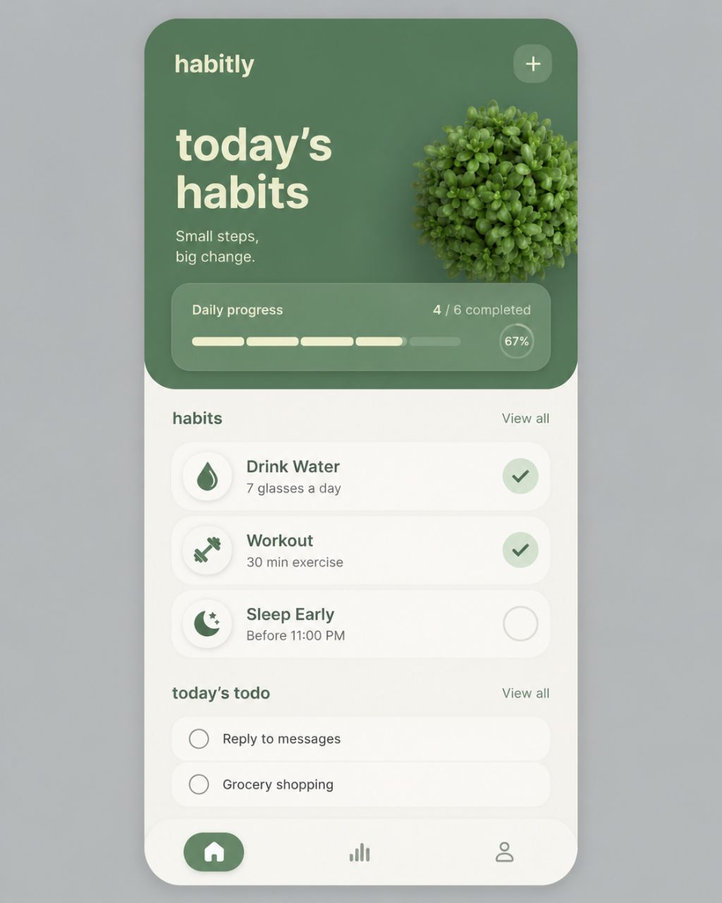

# PRD — Habit App Mobile UI

## 1. Ringkasan Produk

**Habit App** adalah aplikasi **mobile-only** untuk habit tracking harian. Aplikasi ini fokus membantu user melihat, menyelesaikan, dan memantau kebiasaan harian dengan tampilan yang tenang, minimalis, elegan, dan premium.

Target utama saat ini adalah membuat **UI preview HTML/CSS/JS** yang mendekati referensi desain secara konsisten sebelum dikembangkan menjadi aplikasi mobile/APK.

---

## 2. Referensi Visual Utama

Gambar berikut adalah **referensi utama** untuk struktur, warna, spacing, card, tombol, dan mood visual UI.



> Semua perubahan UI berikutnya harus mengikuti arah visual referensi ini. Jika ada konflik antara ide baru dan referensi, gunakan referensi sebagai prioritas.

---

## 3. Platform & Format

- Platform: **Mobile only**
- Orientasi: **Portrait**
- Target ukuran preview: sekitar **390px x 844px**
- Tidak dibuat untuk desktop dashboard
- Desktop hanya boleh menampilkan mockup mobile di tengah layar

---

## 4. Gaya Visual Wajib

UI harus terasa:

- Soft
- Minimalis
- Clean
- Calm
- Wellness-focused
- Rounded
- Premium
- Tidak ramai
- Tidak terlalu colorful

Hindari:

- Warna terlalu kontras/neon
- Layout dashboard desktop
- Elemen terlalu padat
- Banyak teks berlebihan
- Shadow keras
- Sudut tajam

---

## 5. Palet Warna

Gunakan warna mendekati referensi:

```css
--canvas: #cfd3d1;
--app-bg: #f7f6ef;
--hero-green: #3f7655;
--hero-green-soft: #4c805e;
--text-green: #315f46;
--muted-green: #79857b;
--cream-text: #f3efd8;
--card-bg: #fffefa;
--line-soft: #deded5;
--completed-green: #dcebd7;
```

Aturan:

- Hero wajib dominan **sage/deep green**.
- Background utama wajib **cream/off-white**.
- Text utama menggunakan **dark green-gray**.
- Completed state menggunakan **soft pale green**.
- Shadow harus soft dan natural.

---

## 6. Typography

Font utama:

```css
font-family: "Nunito Sans", "Arial Rounded MT Bold", "SF Pro Rounded", system-ui, sans-serif;
```

Karakter font:

- Rounded
- Friendly
- Premium casual
- Tidak terlalu kaku

Panduan ukuran:

- Brand/logo: 24–28px
- Hero title: 50–60px, tidak terlalu bold berlebihan
- Subtitle: 17–18px
- Section title: 20–22px
- Habit title: 18–20px
- Habit subtitle: 14–15px
- Todo text: 16px

---

## 7. Struktur Layar Utama

### 7.1 App Container

- Lebar sekitar 390px
- Tinggi sekitar 844px
- Background `#f7f6ef`
- Border radius besar: 32–34px
- Shadow lembut saat dilihat di desktop preview
- Overflow hidden

### 7.2 Hero Section

Hero adalah elemen paling penting dan harus mirip referensi.

Struktur:

- Mengisi bagian atas layar sekitar 40–50%
- Background deep sage green
- Rounded bottom corners besar
- Padding sekitar 28–31px

Isi hero:

1. Brand/logo kiri atas: `habitly` atau `habit`
2. Tombol tambah kanan atas:
   - Ukuran sekitar 54x54px
   - Rounded square
   - Background translucent white/green
   - Icon `+` warna cream
3. Judul besar:
   - `today’s`
   - `habits`
   - Dua baris
   - Posisi kiri
4. Subtitle:
   - `Small steps,`
   - `big change.`
5. Ilustrasi tanaman/succulent di kanan:
   - Harus terasa natural, hijau, soft
   - Tidak boleh mendominasi teks
   - Boleh sedikit keluar/terpotong di sisi kanan
6. Progress card di bagian bawah hero

### 7.3 Progress Card

Progress card wajib:

- Glassmorphism subtle
- Background translucent putih
- Border putih transparan tipis
- Rounded corner 22–24px
- Shadow lembut
- Berada di bagian bawah hero

Isi:

- Text kiri: `Daily progress`
- Text kanan: `4 / 6 completed` atau progress dinamis
- Segmented progress bar
- Circle percentage badge, contoh `67%`

### 7.4 Habits Section

Header:

- Kiri: `habits`
- Kanan: `View all`

Habit card:

- Background putih/cream
- Border radius 22–25px
- Height sekitar 76–80px
- Shadow halus
- Layout horizontal

Isi setiap card:

1. Icon circle kiri
2. Nama habit
3. Subtitle/goal kecil
4. Tombol check bulat kanan

Default examples:

- `Drink Water` — `7 glasses a day` — checked
- `Workout` — `30 min exercise` — unchecked
- `Sleep Early` — `Before 11:00 PM` — checked

### 7.5 Today’s Todo Section

Header:

- Kiri: `today’s todo`
- Kanan: `View all`

Todo card:

- Lebih pendek dari habit card
- Height sekitar 58px
- Rounded 18–22px
- Checkbox bulat kiri
- Text di kanan

Default examples:

- `Reply to messages`
- `Grocery shopping`

### 7.6 Bottom Navigation

Bottom nav wajib:

- Fixed/absolute di bawah app container
- Height sekitar 86px
- Background cream/off-white
- Rounded top corners besar
- Shadow lembut ke atas

Item:

- Home
- Statistik
- Profile

Active state:

- Home aktif
- Background pill hijau
- Icon cream/white

Inactive state:

- Icon muted green/gray
- Tanpa background

---

## 8. Interaksi Minimum

Untuk preview HTML/CSS/JS:

- Habit check button bisa toggle selesai/belum
- Todo checkbox bisa toggle selesai/belum
- Progress text, segmented bar, dan percentage harus update otomatis
- Tombol `+` membuka bottom sheet untuk tambah habit
- Tambah habit baru harus muncul di list
- Animasi harus halus, tidak berlebihan

---

## 9. Aturan Konsistensi UI

Saat mengedit UI:

1. Jangan mengubah arah visual dari referensi utama.
2. Jangan menambahkan warna baru tanpa alasan kuat.
3. Jaga rounded corner besar di semua card/button.
4. Jaga whitespace agar tampilan tetap calm.
5. Jangan membuat UI terasa seperti dashboard desktop.
6. Semua fitur baru harus tetap mobile-first.
7. Jika layout terasa penuh, gunakan scroll content area, bukan memperkecil semuanya sembarangan.
8. Prioritaskan struktur hero, progress card, habit card, dan bottom nav agar mirip referensi.

---

## 10. Struktur File Project

Lokasi project:

```text
/home/LxArc/Habit App
```

File utama:

```text
index.html
style.css
script.js
PRD.md
assets/reference-ui.jpg
assets/succulent.png
```

---

## 11. Kriteria Selesai UI Preview

UI dianggap sesuai jika:

- Secara visual langsung mengingatkan ke referensi.
- Struktur hero, card, todo, dan bottom nav rapi.
- Warna sage green + cream konsisten.
- Teks dan card tidak amburadul.
- Tanaman terlihat natural dan berada di sisi kanan hero.
- Semua tombol penting terlihat clickable.
- Interaksi dasar berjalan tanpa error.
- Mobile preview tetap nyaman di layar HP.
